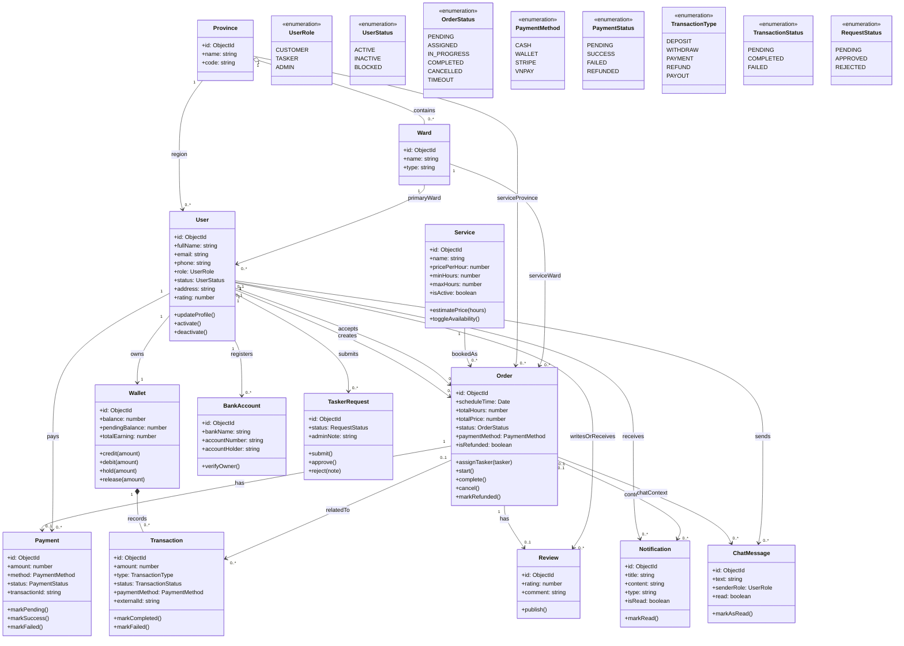

# Class Diagram

Tai lieu nay mo ta class diagram theo goc nhin nghiep vu cua du an Otto. Ban nay duoc rut gon de khac ro voi database diagram: it field hon, co them method chinh, va tap trung vao cach cac doi tuong phoi hop trong he thong.

Luu y:
- Day la domain class diagram, khong sao chep nguyen tung cot trong MongoDB.
- `Ward` trong so do tuong ung voi schema `Location` duoc dang ky alias `Ward`.
- `Payment` mo ta thanh toan qua cong ngoai nhu Stripe/VNPAY.
- `Wallet` va `Transaction` mo ta dong tien noi bo cua he thong Otto.

## Domain Class Diagram

## Cach doc nhanh

- `User` va `Order` la 2 lop trung tam nhat cua he thong.
- `Order` la doi tuong nghiep vu chinh, lien ket voi `Service`, `Payment`, `Review`, `Notification`, `ChatMessage`.
- `Wallet` va `Transaction` tao thanh cum nghiep vu ve vi noi bo, tach biet voi `Payment`.
- Cac `enumeration` nhu `OrderStatus`, `PaymentMethod`, `TransactionType` lam ro hon cac trang thai nghiep vu, thay vi liet ke chi tiet cot DB.

## Khac voi Database Diagram o dau

- Database diagram tap trung vao bang/collection, field, kieu du lieu, khoa lien ket.
- Class diagram tap trung vao doi tuong nghiep vu, thuoc tinh chinh va hanh vi chinh.
- Vi vay, class diagram nay co `method` nhu `assignTasker()`, `markSuccess()`, `credit()`, trong khi database diagram thi khong.

## Nguon doi chieu

- `src/users/user.schema.ts`
- `src/services/service.schema.ts`
- `src/locations/province.schema.ts`
- `src/locations/location.schema.ts`
- `src/orders/order.schema.ts`
- `src/reviews/review.schema.ts`
- `src/payments/schemas/payment.schema.ts`
- `src/wallet/schemas/wallet.schema.ts`
- `src/wallet/schemas/transaction.schema.ts`
- `src/wallet/schemas/bank-account.schema.ts`
- `src/notifications/notification.schema.ts`
- `src/chat/message.schema.ts`
- `src/tasker-requests/tasker-request.schema.ts`
