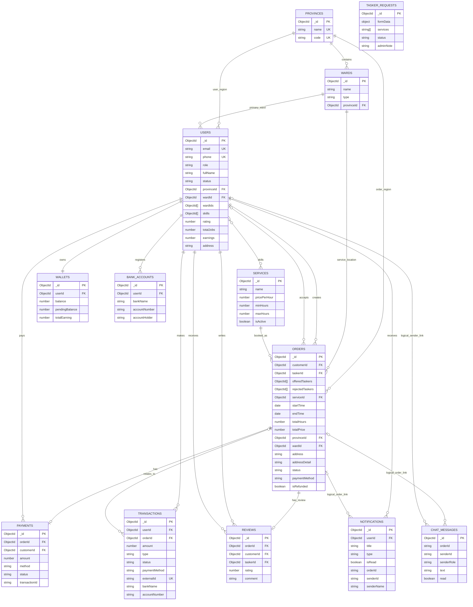

# Entity Relationship Diagram

Tai lieu nay mo ta ERD cua du an Otto duoc suy ra tu cac schema Mongoose trong `otto-backend`.

Luu y:
- Day la MongoDB nen moi "bang" thuc te la `collection`.
- Khoa chinh mac dinh la `_id` kieu `ObjectId`.
- Mot so lien ket dang luu o dang `string` logic thay vi `ObjectId ref`, dac biet trong `notifications` va `chat_messages`.
- `wards` dung schema `Location` va duoc dang ky alias `Ward`.

## Core ERD

## Supporting entities

- `fake_banks`: collection mo phong ngan hang de test nap/rut trong moi truong demo.
- `tasker_requests`: luu ho so dang ky tasker va quy trinh duyet.
- `notifications`, `chat_messages`: lien quan den realtime va lich su thong bao/tin nhan.

## Source schemas

- `src/users/user.schema.ts`
- `src/services/service.schema.ts`
- `src/orders/order.schema.ts`
- `src/reviews/review.schema.ts`
- `src/payments/schemas/payment.schema.ts`
- `src/wallet/schemas/wallet.schema.ts`
- `src/wallet/schemas/transaction.schema.ts`
- `src/wallet/schemas/bank-account.schema.ts`
- `src/notifications/notification.schema.ts`
- `src/chat/message.schema.ts`
- `src/tasker-requests/tasker-request.schema.ts`
- `src/locations/province.schema.ts`
- `src/locations/location.schema.ts`
- `src/orders/order-status.enum.ts`
