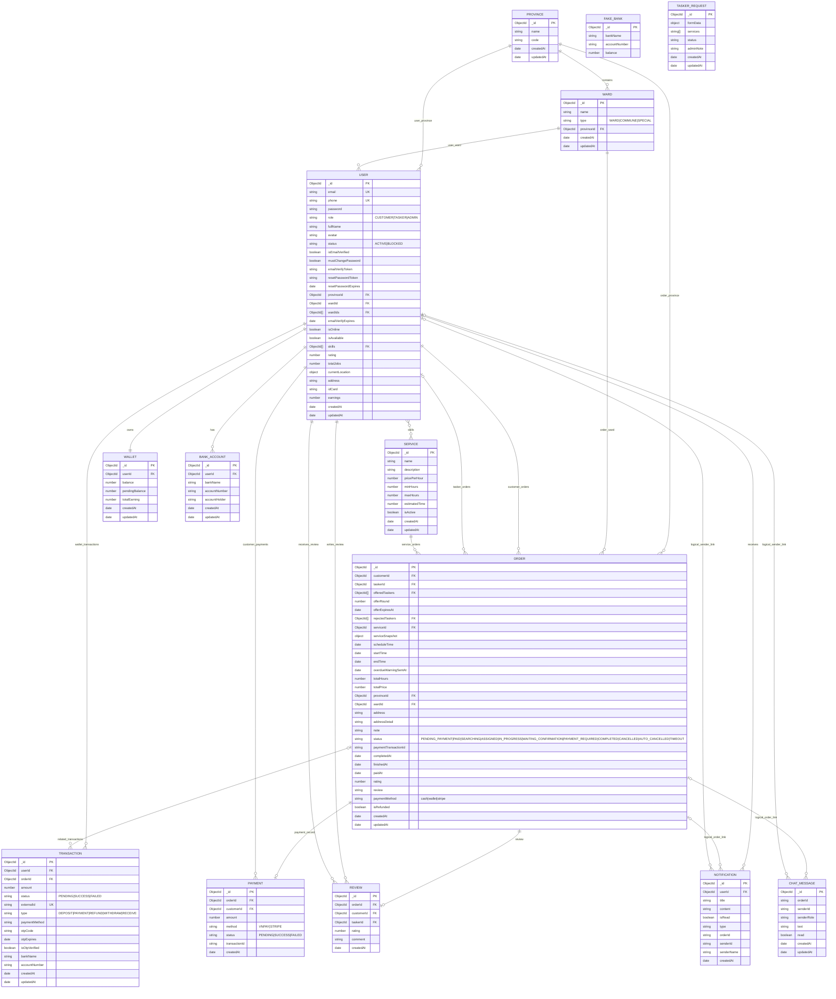

# Mongo Database Diagram

Diagram này được dựng từ các Mongoose schema trong `otto-backend/src`, nên phản ánh cấu trúc model MongoDB hiện tại của hệ thống.

Lưu ý:
- `Ward` là alias của schema `Location`.
- Một số quan hệ đang lưu dưới dạng `string` thay vì `ObjectId ref`, ví dụ `ChatMessage.orderId`, `ChatMessage.senderId`, `Notification.orderId`, `Notification.senderId`.
- Một số trường là mảng `ObjectId`, ví dụ `User.skills`, `User.wardIds`, `Order.offeredTaskers`, `Order.rejectedTaskers`.
- `TaskerRequest.services` hiện lưu `string[]`, không ref trực tiếp sang `Service`.

## Nguồn schema

- `src/users/user.schema.ts`
- `src/orders/order.schema.ts`
- `src/services/service.schema.ts`
- `src/reviews/review.schema.ts`
- `src/payments/schemas/payment.schema.ts`
- `src/wallet/schemas/wallet.schema.ts`
- `src/wallet/schemas/transaction.schema.ts`
- `src/wallet/schemas/bank-account.schema.ts`
- `src/wallet/schemas/fake-bank.schema.ts`
- `src/notifications/notification.schema.ts`
- `src/chat/message.schema.ts`
- `src/tasker-requests/tasker-request.schema.ts`
- `src/locations/province.schema.ts`
- `src/locations/location.schema.ts`
- `src/locations/locations.module.ts`
- `src/orders/order-status.enum.ts`
